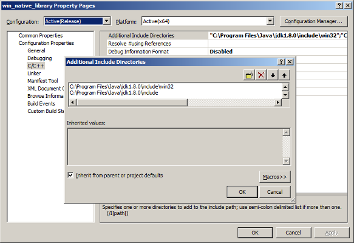

# vaha-win-hotkey

#### What is it?
A Java library providing hotkey capabilities to Java applications on Windows systems. While using the term "Hotkey", we are NOT talking about a structure like java.awt.event.KeyListener interface which is used for receiving keyboard events (keystrokes). This library is totally independent from GUI components. 

#### What is its benefit?
With this hotkey library, you will be able to catch several keyboard events by your application. You don't need any GUI component to utilize this library, but need a desktop environment.

The supported hotkeys are SHIFT, CTRL, ALT, F9, F10, F11, F12 or any combination of them.

#### How to update JNI headers?
The dynamic link library (DLL) files for both Win32 and x64 platforms are already included in [java_library](java_library/src/main/java/com/vahabilisim/win/hotkey) project. However, if you want to be able to compile and build [win_native_library](./win_native_library) project, you need to update "Additional Include Directories" entries of the project for Java Native Interface (JNI) headers according to your JDK home directory (JDK_HOME).

Here is the menu path:  
Project -> Settings -> Configuration Properties -> C/C++ -> General -> Additional Include Directories  

There are two folders containing the JNI headers under your JDK_HOME:
- JDK_HOME/include
- JDK_HOME/include/win32

Also be aware that the project has separate configurations for Win32 and x64 platforms. So, you should update entries for both configurations.

